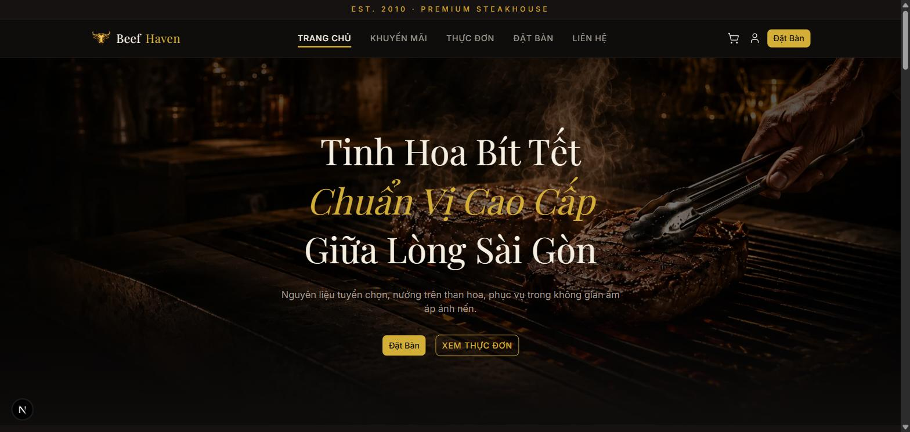
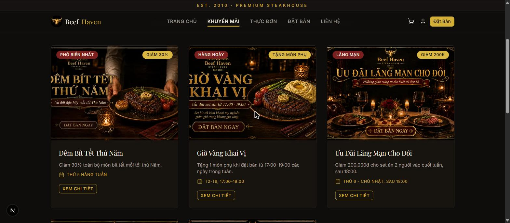
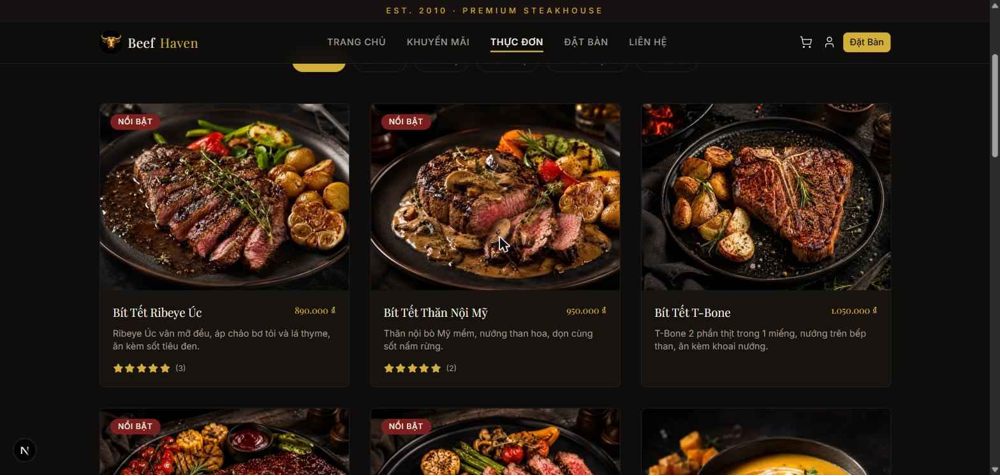
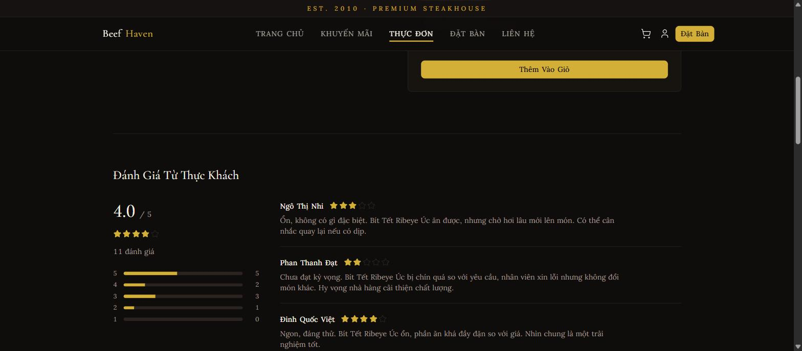
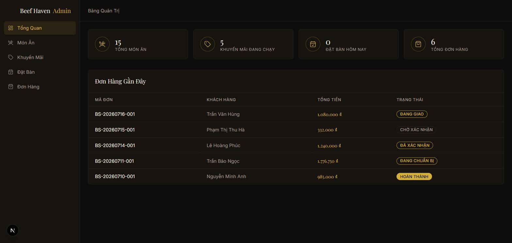
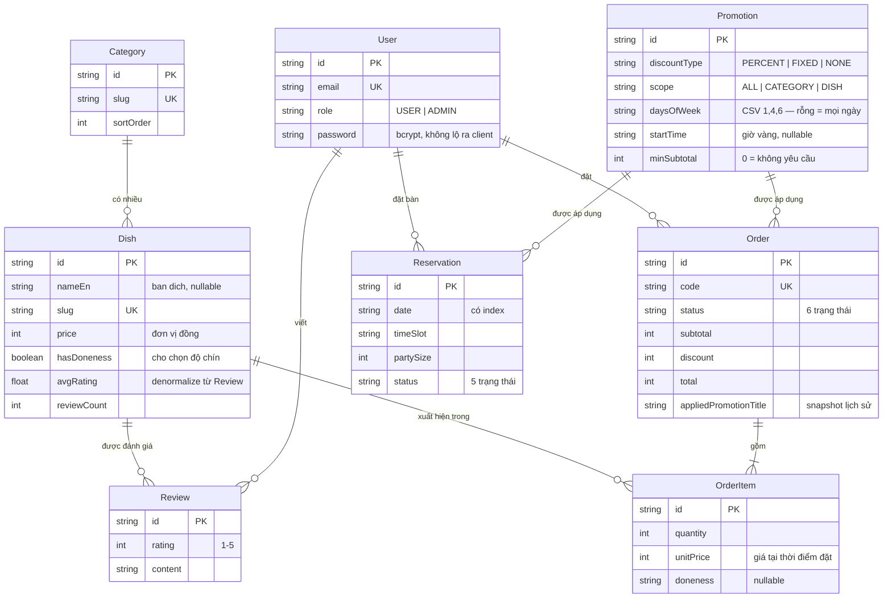

# Beef Haven — website nhà hàng bít tết

Website nhà hàng bít tết đầy đủ hai phía: khách đặt món/đặt bàn, quản trị viên vận hành. Không phải bản demo tĩnh — mọi trang đọc/ghi Postgres thật, và giá tiền luôn được server tính lại chứ không tin số client gửi lên.

**🔗 Demo: https://beefsteakhouse.vercel.app**

### Tài khoản dùng thử

| Vai trò | Email | Mật khẩu | Vào xem được gì |
|---|---|---|---|
| Quản trị | `admin@beefhaven.vn` | `admin1234` | Dashboard thống kê, CRUD món/khuyến mãi, đổi trạng thái đơn & đặt bàn |
| Khách | `hang.do@example.com` | `password123` | 15 đơn đã hoàn thành, 8 lượt đặt bàn, 5 đánh giá đã viết |

> Tài khoản khách chọn từ dữ liệu có sẵn nên có lịch sử thật để xem ngay. Đăng ký mới cũng được, nhưng tài khoản trắng sẽ không viết được đánh giá — tính năng đó yêu cầu đã mua đúng món (xem [phần 2](#2-đánh-giá-chỉ-cho-người-đã-thực-sự-mua)).

---

## Screenshots

| Trang chủ | Khuyến mãi |
|---|---|
|  |  |

| Thực đơn | Đánh giá món |
|---|---|
|  |  |



---

## Tính năng

**Phía khách**

- Trang chủ, danh sách + chi tiết khuyến mãi, thực đơn lọc theo danh mục, chi tiết món
- Giỏ hàng (Zustand, lưu localStorage), chọn độ chín cho món bít tết, ghi chú từng món
- Thanh toán: server tính lại giá và tự chọn khuyến mãi có lợi nhất cho khách
- Đặt bàn theo ngày + khung giờ, có giới hạn chống spam
- Đánh giá món 1–5 sao cho người đã mua món đó, sửa/xoá đánh giá của mình
- Đăng ký / đăng nhập, xem lịch sử đơn hàng và đặt bàn

**Phía quản trị** (`/admin`, chặn theo `role` trong **từng** Server Action)

- Dashboard: doanh thu tháng, số đơn, đặt bàn hôm nay, món bán chạy
- CRUD món ăn và khuyến mãi
- Đổi trạng thái đơn hàng (6 trạng thái) và đặt bàn (5 trạng thái)
- Phân trang server-side qua `searchParams`

**Song ngữ Việt / Anh**

- Tiếng Việt ở URL gốc (`/thuc-don`), tiếng Anh ở `/en/thuc-don` — mọi URL cũ giữ nguyên
- Dịch cả **nội dung trong database**: tên món, mô tả, tiêu đề và badge khuyến mãi
- `hreflang` + canonical trỏ đúng bản đang xem, sitemap có cả hai ngôn ngữ
- Đánh giá của khách **không dịch** — giữ nguyên ngôn ngữ người viết, đúng thực tế

**SEO / vận hành**

- `generateMetadata` theo từng trang, `sitemap.xml` sinh từ DB, `robots.txt`
- JSON-LD `Restaurant` + `Menu`
- Trang lỗi và 404 riêng, **114 unit test** (Vitest), CI chạy lint + test + build mỗi push

---

## Tech stack

| Lớp | Công nghệ |
|---|---|
| Framework | Next.js 16 (App Router, Server Components, Server Actions), React 19 |
| Ngôn ngữ | TypeScript strict |
| UI | Tailwind CSS 4, shadcn/ui (trên Base UI), lucide-react |
| Form | react-hook-form + Zod |
| State client | Zustand — chỉ dùng cho giỏ hàng |
| Database | Postgres (Neon) + Prisma 7 với driver adapter `@prisma/adapter-pg` |
| Auth | Auth.js (next-auth v5), Credentials + bcrypt, session JWT |
| i18n | next-intl (routing `[locale]`, tiếng Việt không prefix) |
| Test / CI | Vitest, GitHub Actions |
| Hosting | Vercel, tự deploy mỗi push lên `main` |

---

## Dữ liệu

Không phải vài dòng mẫu — script seed sinh **lịch sử vận hành 19 tháng** (01/2025 → nay) để dashboard thống kê có gì mà vẽ:

| Bảng | Số lượng |
|---|---|
| Món ăn / danh mục | 15 / 5 |
| Khuyến mãi | 5 |
| Người dùng | 71 |
| Đơn hàng | 632 |
| Đặt bàn | ~457 |
| Đánh giá | 113 |

Số lượng sinh theo hệ số thực tế thay vì random đều: tăng trưởng dần theo tháng, cuối tuần đông hơn ngày thường (Thứ 7 ×1.45, Thứ 2 ×0.65), cao điểm Valentine / Giáng Sinh / tất niên, và giảm mạnh quanh Tết Nguyên Đán vì nhà hàng thật cũng đóng cửa. Tỷ lệ khách không đến (~4%) và huỷ bàn (~11%) đặt theo benchmark ngành F&B; phân bố sao lệch dương giống thực tế (55% năm sao) chứ không phẳng.

Chi tiết quan trọng: đơn hàng trong seed tính giảm giá bằng **đúng hàm `bestPromotion()` mà app đang chạy**, không phải công thức riêng — nên dữ liệu lịch sử không thể lệch khỏi logic tính tiền hiện tại.

---

## Sơ đồ database



`Review` có `@@unique([userId, dishId])` — mỗi người đánh giá một món đúng một lần.

Các cột `*En` (trên `Category`, `Dish`, `Promotion`) là bản dịch tiếng Anh, đều nullable: chưa dịch thì giao diện tự hiển thị bản tiếng Việt thay vì để trống.

---

## 4 vấn đề khó nhất và cách giải

### 1. Discount engine dùng chung client/server mà không tin client

Khuyến mãi ở đây không phải "giảm 10% toàn menu". Mỗi khuyến mãi có phạm vi riêng (toàn menu / một danh mục / một món), điều kiện thứ trong tuần, khung giờ vàng, ngày bắt đầu–kết thúc, và ngưỡng giá trị đơn tối thiểu. Nhiều khuyến mãi có thể cùng thoả điều kiện, phải chọn cái có lợi nhất cho khách.

Cách giải: `bestPromotion(lines, promos, now)` trong `src/lib/promotions/apply.ts` là **hàm thuần** — không đọc DB, và không gọi `Date.now()` bên trong mà nhận `now` qua tham số. Hệ quả:

- **Client** gọi để hiện giá ngay khi khách sửa giỏ hàng, không cần round-trip.
- **Server** gọi lại đúng hàm đó lúc tạo đơn, **tính lại từ đầu và bỏ qua mọi con số client gửi lên** — sửa giá trong DevTools không ăn được.
- **Script seed** cũng gọi hàm đó, nên dữ liệu lịch sử luôn khớp logic thật.
- Truyền `now` vào giúp test được "thứ Năm 18:00" mà không phải giả lập đồng hồ hệ thống.

Engine này được test xong **trước khi** có bất kỳ UI nào phụ thuộc vào nó, vì bug tính tiền phát hiện muộn thì phải sửa lại cả giỏ hàng và trang thanh toán.

### 2. Đánh giá chỉ cho người đã thực sự mua

Cho ai đăng nhập cũng đánh giá thì phần review thành bãi rác. Điều kiện thật: người dùng phải có một `Order` trạng thái `COMPLETED` chứa đúng món đó (`getHasPurchasedDish`). Chống đánh giá trùng đặt ở **tầng database** bằng `@@unique([userId, dishId])`, không dựa vào việc UI ẩn nút — UI có thể bị bỏ qua, ràng buộc DB thì không.

Phần khó nằm ở trải nghiệm: gọi Server Action rồi chờ round-trip thì cảm giác chậm. Giải bằng `useOptimistic` với một reducer chung cho cả ba thao tác thêm/sửa/xoá, nên đánh giá hiện ra ngay, sau đó `router.refresh()` đồng bộ lại số liệu thật. Điểm trung bình hiển thị tính từ mảng review đang có trên client bằng đúng công thức server dùng, nên hai bên không lệch.

Một chi tiết bảo mật dễ trượt: khi lấy review kèm thông tin người viết, `include: { user: true }` trả về cả cột `password` (bcrypt hash) ra tận client qua props của component. Phải `select` tường minh từng field. Đây là quy tắc áp cho mọi chỗ populate quan hệ tới `User`.

### 3. Không tin bất cứ thứ gì client gửi lên

Server Action trông như gọi hàm bình thường, nhưng dữ liệu đi qua network và **type TypeScript bị xoá lúc runtime**. `createOrder(values, items)` ban đầu chỉ validate `values` bằng Zod, còn mảng `items` nhận nguyên — nên `quantity: -10` vào thẳng phép tính tiền và tạo được đơn hàng có **tổng tiền âm**. Server tính lại *giá* từ database nhưng vẫn tin *số lượng* của client.

Cùng loại lỗi ở chỗ khác: `<input type="date" min={today}>` chỉ chặn người dùng bình thường, request tự soạn vẫn đặt bàn được cho ngày đã qua; `doneness` gửi lên cho món không có tuỳ chọn độ chín thì bếp nhận phiếu "Tiramisu — Chín Kỹ".

Cách giải: Zod hoá **mọi** tham số của Server Action, không chỉ cái trông giống form; chuẩn hoá lại từng dòng theo dữ liệu database; và tách phần kiểm tra phụ thuộc thời gian thành hàm thuần nhận `now` qua tham số (`isBookingDateAllowed`) để test được mà không phải giả lập đồng hồ.

Một biến thể tinh vi hơn của "không tin client" là **không lộ dữ liệu ra client**: `getReviews` từng `select` cả `email` của người đánh giá. Trang món là trang công khai nên field đó đi vào payload trong HTML — một trang lộ 10 email, quét hết trang là gom được gần như toàn bộ người dùng. Sửa bằng cách thu hẹp `select`, **và** thu hẹp luôn kiểu dữ liệu (`ReviewAuthor = { name: string }`) để lần sau đọc `review.user.email` sẽ không biên dịch được.

### 4. Xây xong toàn bộ frontend rồi mới cắm database, không sửa lại page nào

Rủi ro lớn nhất của dự án cá nhân là làm 50% của sáu mảng rồi bỏ dở. Nên frontend được làm xong trước với dữ liệu mock — nhưng nếu page gọi thẳng mock thì lúc thay database sẽ phải sửa từng page.

Cách giải: mọi page bắt buộc đi qua tầng `src/lib/data/*`, và các hàm ở tầng đó khai `async` ngay từ đầu dù mock trả về đồng bộ. `src/types/index.ts` viết trước, cả mock và Prisma schema đều bám theo nó.

Kết quả khi cắm Postgres thật: chỉ thay **ruột** các hàm trong `lib/data/`, giữ nguyên chữ ký — không page nào phải sửa. Cùng lý do đó, đổi từ SQLite sang Neon Postgres sau này cũng chỉ là đổi driver adapter, không lan ra tầng UI.

---

## Chạy trên máy

Cần Node 22+ và một database Postgres (Neon miễn phí là đủ).

```bash
git clone https://github.com/hungknh/BeefSteakRestaurant.git
cd BeefSteakRestaurant
npm install                 # postinstall tự chạy `prisma generate`

cp .env.example .env        # rồi điền DATABASE_URL, DIRECT_URL, AUTH_SECRET

npx prisma migrate deploy   # tạo bảng
npx prisma db seed          # sinh dữ liệu lịch sử (~vài phút, ghi tuần tự qua network)

npm run dev                 # http://localhost:3000
```

Các lệnh khác:

```bash
npm test          # Vitest, 114 test
npm run lint      # ESLint
npm run build     # Next production build
```

Lưu ý về `.env`: `DATABASE_URL` nên là connection **pooled** (PgBouncer) cho app runtime vì serverless mở nhiều connection ngắn hạn; `DIRECT_URL` là connection thẳng, chỉ Prisma Migrate dùng vì DDL không ổn định qua pooler.

---

## Cấu trúc

```
src/
├── app/
│   ├── (public)/           # trang khách — có Header/Footer
│   ├── (auth)/             # đăng nhập, đăng ký — layout tối giản
│   ├── admin/              # khu quản trị — sidebar riêng
│   ├── sitemap.ts          # sinh từ DB
│   └── robots.ts
├── components/             # ui/ (shadcn) + theo miền: home, menu, admin, review...
├── lib/
│   ├── data/               # ⭐ tầng truy vấn duy nhất mà page được gọi
│   ├── actions/            # Server Actions (mutation)
│   ├── promotions/apply.ts # ⭐ discount engine, hàm thuần
│   ├── validations/        # schema Zod dùng chung client/server
│   ├── auth/               # requireAdminSession()
│   └── seo/                # JSON-LD
├── i18n/                   # ⭐ routing locale, Link/router locale-aware
├── store/cart.ts           # Zustand
└── types/index.ts          # ⭐ nguồn type gốc, viết trước cả schema

messages/                   # vi.json + en.json (có test kiểm 2 file khớp key)

prisma/
├── schema.prisma
├── seed.ts                 # sinh lịch sử 19 tháng
└── seed-data/              # hệ số ngày lễ, tên khách VN, mẫu câu review
```
